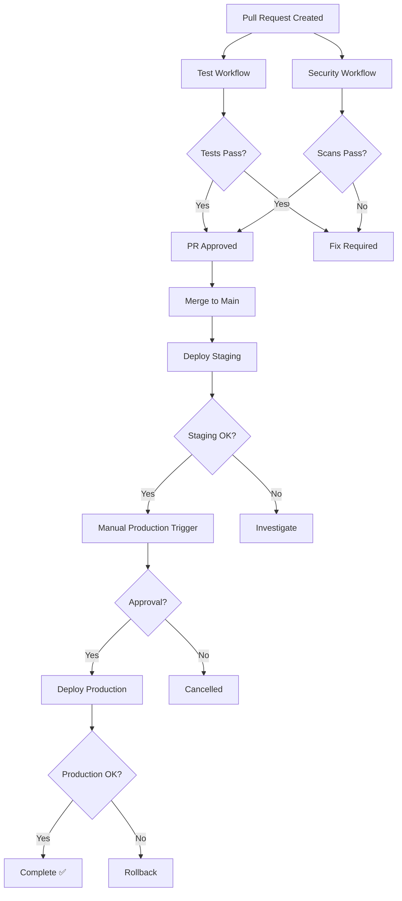

# GitHub Actions Workflows

Documentation for all CI/CD workflows in the Pixel Prompt repository.

## Workflow Overview

| Workflow | File | Trigger | Duration | Purpose |
|----------|------|---------|----------|---------|
| [Test](#test-workflow) | `test.yml` | PR, push to main | ~5 min | Run frontend and backend tests |
| [Security Scanning](#security-scanning-workflow) | `security.yml` | PR, push, weekly | ~3 min | Vulnerability scanning |
| [Deploy Staging](#deploy-staging-workflow) | `deploy-staging.yml` | Push to main | ~10 min | Deploy backend to staging |
| [Deploy Production](#deploy-production-workflow) | `deploy-production.yml` | Manual, release | ~15 min | Deploy backend to production |

## Workflow Dependency Graph



## CI/CD Pipeline Flow

### Development Flow

```
Developer → Feature Branch → Push → PR
                                   ↓
                            Test + Security
                                   ↓
                            Review + Approve
                                   ↓
                                 Merge
                                   ↓
                            Deploy Staging
                                   ↓
                            Verify Staging
                                   ↓
                      Manual Production Deploy
                                   ↓
                            Deploy Production
                                   ↓
                                  Done ✅
```

## Workflow Details

### Test Workflow

**File**: `.github/workflows/test.yml`

**Triggers**:
- Pull request to `main` branch
- Push to `main` branch

**Jobs**:

#### 1. test-frontend
- **Runs on**: ubuntu-latest
- **Node version**: 18
- **Steps**:
  1. Checkout code
  2. Setup Node.js with npm cache
  3. Install dependencies (`npm ci`)
  4. Run linter (`npm run lint`)
  5. Run tests (`npm test`)
  6. Run build (`npm run build`)
  7. Upload coverage artifacts

**Expected duration**: ~3 minutes

#### 2. test-backend
- **Runs on**: ubuntu-latest
- **Python version**: 3.12
- **Steps**:
  1. Checkout code
  2. Setup Python with pip cache
  3. Install dependencies
  4. Run unit tests with coverage
  5. Run fast integration tests
  6. Upload coverage artifacts

**Expected duration**: ~2 minutes

**Artifacts**:
- Frontend coverage report (30 day retention)
- Backend coverage report (30 day retention)

**Failure handling**:
- Workflow fails if any test fails
- PR cannot be merged until tests pass

---

### Security Scanning Workflow

**File**: `.github/workflows/security.yml`

**Triggers**:
- Pull request to `main` branch
- Push to `main` branch
- Scheduled: Weekly on Mondays at 9:00 AM UTC
- Manual dispatch

**Jobs**:

#### 1. npm-audit (Frontend)
- **Checks**: JavaScript dependency vulnerabilities
- **Tool**: `npm audit`
- **Threshold**: Fails on high/critical vulnerabilities
- **Artifacts**: npm-audit-report.json

#### 2. bandit-scan (Backend)
- **Checks**: Python security issues
- **Tool**: `bandit`
- **Threshold**: Fails on high/critical issues
- **Artifacts**: bandit-report.json

#### 3. dependency-review
- **Checks**: New dependency vulnerabilities in PRs
- **Tool**: GitHub Dependency Review Action
- **Threshold**: Fails on high severity
- **Runs**: Only on pull requests

**Expected duration**: ~3 minutes

**Failure handling**:
- High/critical vulnerabilities block merge
- Review artifacts for details
- Fix vulnerabilities or document exceptions

---

### Deploy Staging Workflow

**File**: `.github/workflows/deploy-staging.yml`

**Triggers**:
- Push to `main` branch (after merge)
- Manual dispatch

**Requirements**:
- All tests must pass
- Security scans must pass

**Jobs**:

#### deploy-staging
- **Runs on**: ubuntu-latest
- **Environment**: staging (optional)
- **Steps**:
  1. Checkout code
  2. Setup Python 3.12
  3. Install AWS SAM CLI
  4. Configure AWS credentials (from GitHub Secrets)
  5. Deploy backend with SAM
     - Stack name: `pixel-prompt-staging` (or from secret)
     - Parameters: API keys from secrets
  6. Get stack outputs (API endpoint)
  7. Run health check on API
  8. Run smoke test (generate test image)
  9. Generate deployment summary
  10. Create issue on failure

**Expected duration**: ~10 minutes

**Secrets required**:
- `AWS_ACCESS_KEY_ID`
- `AWS_SECRET_ACCESS_KEY`
- `AWS_REGION` (optional, defaults to us-east-1)
- `MODEL_1_KEY` through `MODEL_9_KEY` (optional)
- `STACK_NAME_STAGING` (optional)

**Outputs**:
- API endpoint URL
- Deployment timestamp
- Commit SHA

**Failure handling**:
- Creates GitHub issue with deployment details
- Includes workflow run link
- Tags with `deployment`, `staging`, `bug`

---

### Deploy Production Workflow

**File**: `.github/workflows/deploy-production.yml`

**Triggers**:
- Manual dispatch (with confirmation input)
- Release published (tags like `v1.0.0`)

**Requirements**:
- Pre-deployment checks pass
- Manual approval (GitHub Environment protection)
- All tests passing

**Jobs**:

#### 1. pre-deployment-checks
- Validates confirmation input (manual trigger)
- Checks version tag format (release trigger)
- Verifies tests passed

#### 2. deploy-production
- **Requires**: pre-deployment-checks
- **Environment**: production (requires manual approval)
- **Steps**:
  1. Checkout code
  2. Setup Python 3.12
  3. Install AWS SAM CLI
  4. Configure AWS credentials
  5. Deploy backend with SAM
     - Stack name: `pixel-prompt-production` (or from secret)
     - Parameters: API keys from secrets
  6. Get stack outputs (API endpoint, S3 bucket, CloudFront)
  7. Run comprehensive health checks:
     - Gallery endpoint test
     - Generate endpoint test
     - Enhance endpoint test
  8. Monitor CloudWatch logs for errors
  9. Generate deployment report
  10. Create issue on failure
  11. Comment on release (if triggered by release)

**Expected duration**: ~15 minutes (including approval wait time)

**Secrets required**:
- Same as staging, plus:
- `STACK_NAME_PRODUCTION` (optional)

**Manual approval**:
- Required reviewer must approve deployment
- Configured in GitHub Environment settings
- Prevents accidental production deploys

**Failure handling**:
- Creates critical GitHub issue
- Includes rollback procedure
- Tags with `deployment`, `production`, `critical`, `bug`

---

## Manual Workflow Triggers

### Via GitHub UI

1. Go to **Actions** tab
2. Select workflow from left sidebar
3. Click **Run workflow** button
4. Fill in required inputs (if any)
5. Click **Run workflow**

### Via GitHub CLI

```bash
# Trigger test workflow
gh workflow run test.yml

# Trigger security scan
gh workflow run security.yml

# Trigger staging deployment
gh workflow run deploy-staging.yml

# Trigger production deployment (requires confirmation)
gh workflow run deploy-production.yml -f confirmation="deploy-production"
```

## Workflow Monitoring

### Status Badges

Embed in README:
```markdown


```

### Viewing Runs

**Recent runs**:
```bash
gh run list --limit 10
```

**Specific workflow**:
```bash
gh run list --workflow=test.yml --limit 5
```

**Watch run**:
```bash
gh run watch RUN_ID
```

### Downloading Artifacts

**Via GitHub UI**:
1. Actions → Select run
2. Scroll to Artifacts section
3. Click artifact name to download

**Via GitHub CLI**:
```bash
gh run download RUN_ID
```

## Workflow Permissions

### Repository Secrets

**Location**: Settings → Secrets and variables → Actions

**Required**:
- AWS credentials
- API keys for model providers

**Optional**:
- Stack names (use defaults if not set)
- Slack webhook (for notifications)

### Environment Secrets

**Location**: Settings → Environments → [environment] → Secrets

**Production environment**:
- Can override repository secrets
- Requires manual approval
- Limits deployment to `main` branch

### IAM Permissions

AWS credentials must have permissions for:
- CloudFormation (CreateStack, UpdateStack, DeleteStack)
- Lambda (CreateFunction, UpdateFunctionCode)
- S3 (CreateBucket, PutObject, GetObject)
- API Gateway (CreateApi, UpdateApi)
- IAM (CreateRole, AttachRolePolicy)
- CloudWatch (PutLogEvents)

Recommended: Use `AdministratorAccess` for development, create restrictive policy for production.

## Workflow Caching

### npm Cache

Frontend workflow caches `node_modules`:
```yaml
- uses: actions/setup-node@v4
  with:
    cache: 'npm'
    cache-dependency-path: frontend/package-lock.json
```

**Speeds up**: Dependency installation from ~2min to ~30s

### pip Cache

Backend workflow caches Python packages:
```yaml
- uses: actions/setup-python@v5
  with:
    cache: 'pip'
    cache-dependency-path: backend/requirements.txt
```

**Speeds up**: Dependency installation from ~1min to ~20s

### Cache Invalidation

Caches automatically invalidate when:
- `package-lock.json` changes (npm)
- `requirements.txt` changes (pip)

Manual cache clear:
```bash
gh cache delete --all
```

## Workflow Optimization

### Current Performance

| Workflow | Duration | Optimizations Applied |
|----------|----------|----------------------|
| Test | ~5 min | Parallel jobs, caching |
| Security | ~3 min | Parallel jobs |
| Deploy Staging | ~10 min | SAM caching |
| Deploy Production | ~15 min | Comprehensive checks |

### Future Optimizations

- [ ] Matrix testing (multiple Node/Python versions)
- [ ] Test result caching
- [ ] Incremental builds
- [ ] Parallel deployments (frontend + backend)

## Troubleshooting

See [CI/CD Troubleshooting Guide](../docs/CI_CD_TROUBLESHOOTING.md) for:
- Workflow won't trigger
- Test failures
- Security scan failures
- Deployment failures
- Common errors and solutions

## Additional Resources

- [GitHub Actions Documentation](https://docs.github.com/en/actions)
- [AWS SAM CLI Reference](https://docs.aws.amazon.com/serverless-application-model/latest/developerguide/serverless-sam-cli-command-reference.html)
- [Deployment Secrets Guide](DEPLOYMENT_SECRETS.md)
- [Production Deployment Guide](PRODUCTION_DEPLOYMENT.md)
- [CI/CD Monitoring Guide](../docs/CI_CD_MONITORING.md)

---

**Questions?** Open an issue with the `ci` label.
